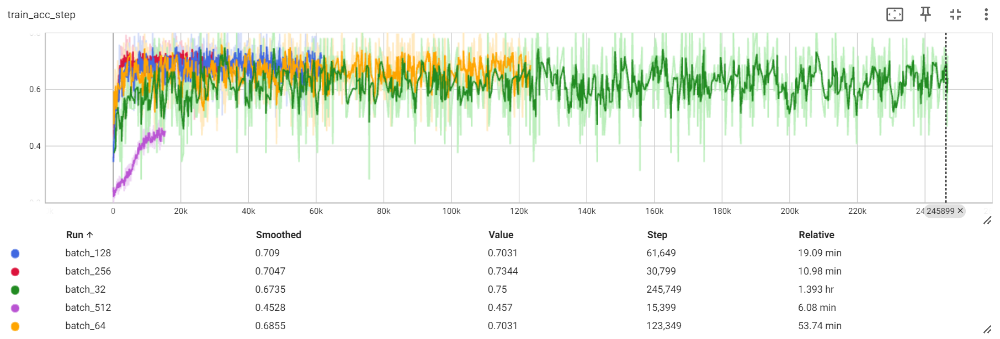
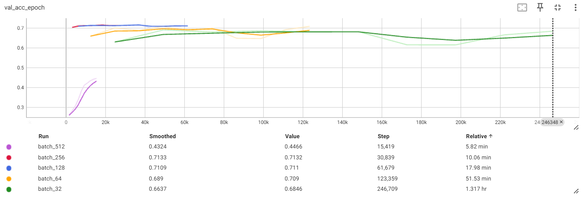
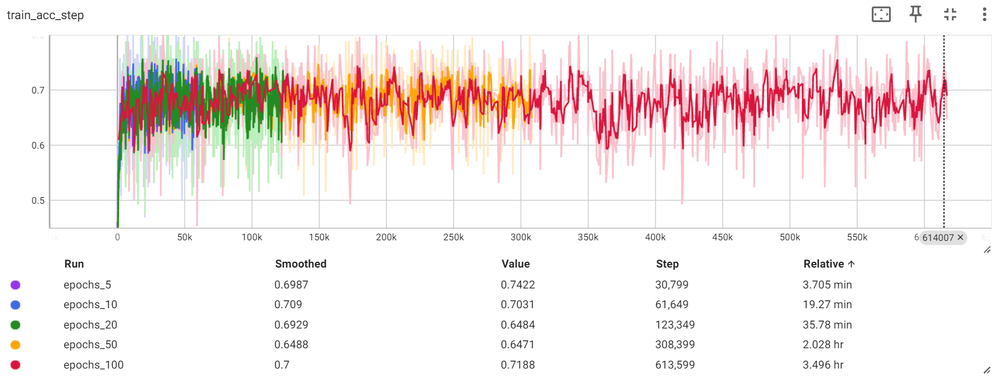
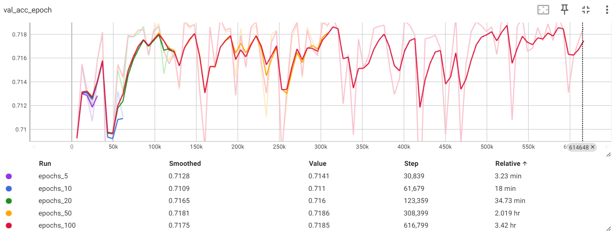
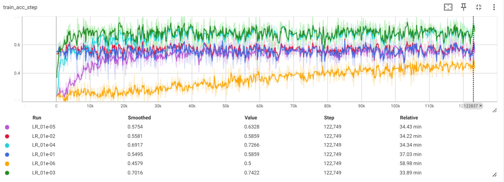
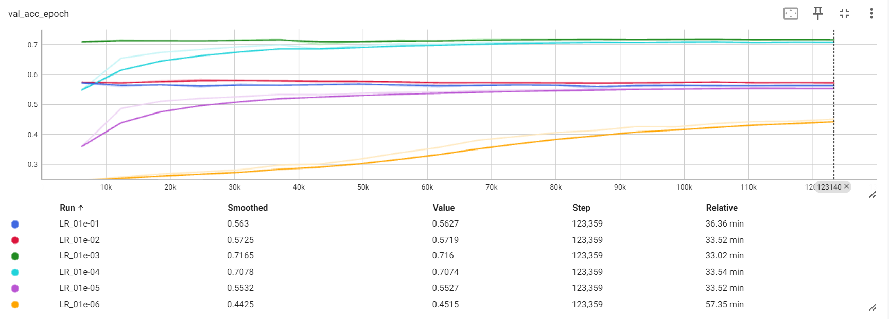
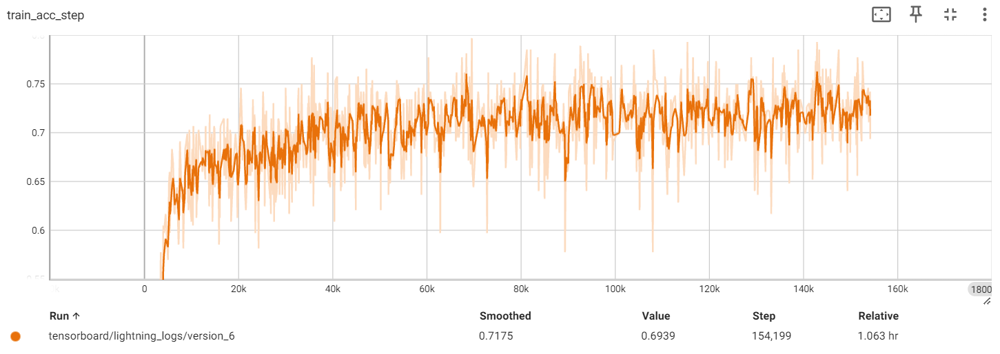
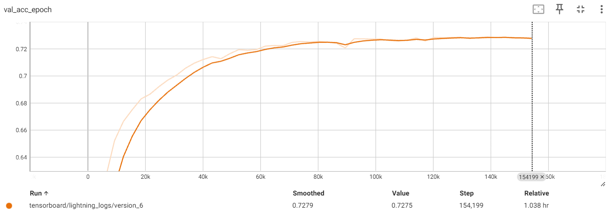

Data was trained using a bash file see Run_Training_Models.sh for detail

## Modifying Batchsize

### 1.  What is the impact of varying batch sizes and why?

The batchsize of a network is a very important hyperparameter. It represents the number of samples used in one forward and backwards pass of the network. Batch sizes of 32, 64, 128, 256 and 512 will be tested, with other parameters set as MASE's default. 


*Figure 1: Train Learning Curve with Different Batch Sizes*


*Figure 2: Validation Learning Curve with Different Batch Sizes*

The study on how batch size affects neural network performance reveals that extreme batch sizes significantly impact learning efficiency and accuracy. Figures 1 and 2 illustrate that a small batch size of 32 leads to the second lowest validation accuracy (67%) coupled with the longest training time (1.39 hr). Conversely, a large batch size of 512, while substantially reducing training time (6.08 min), results in a decrease in both training and validation accuracy, achieving only 44.6% in validation accuracy.

An optimal batch size seems to be 256, which yields the highest validation accuracy (71%) and the second shortest training duration (10.06 min). Figures 1 and 2 highlight the critical role of batch size adjustment. Varying the batch size can almost halve the validation error and reduce training times by 1357%. Therefore, choosing an optimal batch size is key to neural network success.

The batch size influences training time, as larger batch sizes enable more efficient use of resources like GPUs, which are optimized for parallel processing. However, excessively large batches can strain GPU memory, potentially leading to crashes or other issues.

Conversely, smaller batch sizes are often linked to better generalization since they provide noisier estimates of the gradient. This variance can sometimes hinder the learning process, but it also leads to better generalization. Studies have shown that smaller batch sizes tend to converge to flatter minima, while large batch sizes converge to sharp minima, which are associated with poorer generalization.

https://medium.com/geekculture/why-small-batch-sizes-lead-to-greater-generalization-in-deep-learning-a00a32251a4f

## Modifying Epoch Number

Epoch Number of 10, 20, 50 and 100 will be tested, using a learning rate of 0.001, with other parameters set as MASE's default.

### 1.  What is the impact of varying maximum epoch number?


*Figure 3: Train Learning Curve with Different Max Epochs*


*Figure 4: Validation Learning Curve with Different Max Epochs*

Figures 3 and 4 demonstrate that varying the final epoch number has a minimal effect on validation accuracy (Range: 0.016); despite slight variations, the results generally converge to a similar value. However, training times are significantly impacted. For instance, setting the epoch number to 100 leads to training of over 3.5 hours, without any improvement in validation accuracy compared with 5 epochs, which achieves similar accuracy in only 3.7 minutes.

Considering the maximum epoch number is crucial, as excessive computation not only increases costs but also risks overfitting the training data. Given the small size of this model and its limited dataset, training for numerous epochs is unnecessary and inefficient, as shown by the results of this test.

## Modifying Learning Rate

### 3.1. What is happening with a large learning and what is happening with a small learning rate and why?

Learning rates of 0.01, 0.001, 0.0001 and 0.00001 were tested, with other parameters set as MASE's default.


*Figure 5: Train Learning Curve with Different Learning Rates*


*Figure 6: Validation Learning Curve with Different Learning Rates*

Figures 5 and 6 illustrate a significant change between different learning rates. Notably, a smaller learning rate converges extremely slowly, resulting in the final validation and training accuracy being considerably lower than models with higher learning rates. As the max epoch was restricted to 20 in this test, the small learning rate model could reach the accuracies of other learning rates if the epoch number was increased. However, this would cause the training times to be excessive, with no accuracy benefit. All training times were similar, except for the smallest learning rate, which was considered an anomaly as the others varied little. Although training time doesn't change considerably with learning rate, a small learning rate might converge so slowly that it requires more epochs, thus increasing training time.

On the other hand, a high learning rate of 0.1 converged very quickly to a minimum, but it settled on a local minimum instead of a global one, evidenced by the low validation and training accuracy with no further convergence.

This test shows that the learning rate is crucial in determining the size of the step towards optimal weights. A large learning rate can overshoot the optimum solution, causing the optimizer to get stuck in a local minimum. Conversely, a small learning rate may lead to excessively slow convergence to an optimum. Ideally, the learning rate would continuously adapt to provide the best balance.

The Adam optimizer adjusts the learning rate during training; however, the initial learning rate still sets the scale of the updates. This means it can influence how quickly the optimizer converges to a solution or whether it converges at all.

A learning rate of 10e-3 demonstrated the best performance, with both fast convergence and the highest validation accuracy. This highlights the importance of selecting a suitable learning rate to ensure convergence to a global minimum while also balancing training time.

### 3.2. What is the relationship between learning rates and batch sizes?


*Figure 7: Train Learning Curve with Different Batch Sizes*


*Figure 8: Validation Learning Curve with Different Batch Sizes*

The relationship between batch size and learning rate is crucial in getting an optimum neural network. A smaller batch size often requires a lower learning rate to maintain stability due to the increased noise in gradient estimates, which can be beneficial for escaping local minima and improving generalization. Conversely, larger batch sizes provide more stable, but less noisy, gradient information, allowing for the use of higher learning rates and potentially faster convergence. However, this can sometimes lead to poorer generalization. The choice of batch size and learning rate also influences the computational efficiency of training. While larger batches are more computationally efficient due to better hardware utilization, they require careful tuning of the learning rate to avoid suboptimal training results. This interplay necessitates a balanced approach, often requiring empirical tuning to optimize model performance.

## 10x More Parameter Network {#10x-more-parameter-network}

### 4.  Implement a network that has in total around 10x more parameters than the toy network.

```python
# Implemented Model
class JSC_Tiny_x10(nn.Module):
    def __init__(self, info):
        super(JSC_Tiny_x10, self).__init__()
        self.seq_blocks = nn.Sequential(
            # 1st Layer
            nn.BatchNorm1d(16),
            nn.ReLU(),
            nn.Linear(16, 40),  # Increased number of output features

            # Additional Layers
            nn.BatchNorm1d(40),
            nn.ReLU(),
            nn.Linear(40, 25),  # New layer

            # Final Layer
            nn.BatchNorm1d(25),
            nn.ReLU(),
            nn.Linear(25, 5),  # Output layer with 5 features as in the original model
        )

    def forward(self, x):
        return self.seq_blocks(x)

# Added getter
def get_jsc_x10(info):
    return JSC_Tiny_x10(info)

# Added to model to PHYSICAL_MODELS
"jsc-tiny-x10": {
    "model": get_jsc_x10,
    "info": MaseModelInfo(
        "jsc-s",
        model_source="physical",
        task_type="physical",
        physical_data_point_classification=True,
        is_fx_traceable=True,
    ),
```

### 5.  Test your implementation and evaluate its performance.


*Figure 9: Train Learning Curve with Different Batch Sizes*


*Figure 10: Validation Learning Curve with Different Batch Sizes*

*Table 1: Test Data Performance*
| Metric |   Tiny   | Tiny x10 |
|--------|----------|----------|
|  acc   | 0.716586 | 0.726731 |
| loss   | 0.846463 | 0.777506 |

Training for the X10 model was completed with a batch size of 256 and for 50 epochs, with all other parameters set to default. The Tiny model, used for comparison, was performed with only 20 epochs and a batch size of 256, with all other parameters set to default. It is important to note that, in either model, no hyperparameter was optimized.

Evaluating the larger model's test performance (see Table 1), we see that there is a slight improvement in accuracy. Additionally, Figures 9 and 10 demonstrate a considerably longer training time, as more epochs were used, paired with more computation due to more weights needing to be calculated and updated. Comparing the large model to the smaller Tiny network, we observe a slightly lower error rate. The smaller model is not a great model for comparison as it uses fewer epochs; however, it does show that, without hyperparameter optimization, a considerably smaller model with fewer parameters and epochs can achieve similar accuracy to a model with 10 times the parameters. This demonstrates that machine learning engineers cannot just make models larger to improve accuracy but also have to optimize hyperparameters and model types, such as adding convolutional layers and changing network type.

Furthermore, Figure 10 demonstrates that the validation accuracy exhibits minimal improvement after 25 epochs, suggesting that implementing early stopping criteria could effectively reduce computation.

