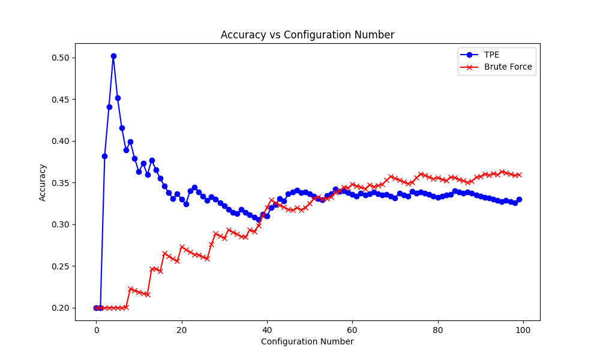

### 1. Explore additional metrics that can serve as quality metrics for the search process. For example, you can consider metrics such as latency, model size, or the number of FLOPs (floating-point operations) involved in the model.

- Precision and Recall
Precision: The ratio of true positive predictions to the total number of positive predictions (including false positives).
Recall: The ratio of true positive predictions to the actual number of positive cases.
Usefulness: These metrics are crucial when dealing with imbalanced datasets. Precision is important when false positives are costly (email spam detection), while recall is important when false negatives carry higher risk (disease detection).

- F1 Score

Formula:

                Precision * Recall
 F1 Score = 2 * ------------------
                Precision + Recall

Description: The F1-score metric combines precision and recall, as indicated by its formula. A high F1 score signifies both high precision and recall. This metric is particularly valuable in situations where finding a balance between precision and recall is crucial, such as in document classification. While the F1 score provides a single metric for comparing classifiers, it could obscure large differences in precision or recall, as it assigns equal weight to both. In cases where it is imperative to minimize false positives or negatives, using precision and recall metrics separately may be more appropriate.

- GPU Energy Consumption
Description: The energy required by GPUs for training or inference processes is becoming increasingly important for sustainable AI development, especially in scenarios with limited power resources like mobile devices. Large Language Models, such as OpenAI's ChatGPT, often require substantial power for training, estimated at around 10 GWh, equivalent to the average yearly consumption of 1,000 households. Additionally, with the extensive use of ChatGPT, resulting in hundreds of millions of queries, the daily energy consumption is estimated to be equivalent to 1 GWh, or the daily usage of 33,000 households. Consequently, it is crucial to make concerted efforts in reducing the energy consumption of these models to enhance the sustainability of AI technologies

https://www.washington.edu/news/2023/07/27/how-much-energy-does-chatgpt-use/

- Latency: Latency is a critical factor for neural networks during both the backward and forward passes. Measuring latency provides an estimate of the speed at which a neural network can deliver results upon receiving inputs. This aspect is crucial in numerous fields, such as high-frequency trading and autonomous driving. Latency can determine the feasibility of a model in specific scenarios. For instance, in autonomous driving, a neural network that outputs results with a delay of one second could potentially lead to a car crash. Moreover, the duration required for a model to process inputs and update weights significantly impacts training efficiency. A model that can train more rapidly not only consumes less energy but may also reach an optimal solution faster compared to one with higher latency.

### 2.1. Implement some of these additional metrics and attempt to combine them with the accuracy or loss quality metric.

Metrics Implemented:

- GPU energy consumption
- Precision
- Recall
- F1 Score
- Latency

Reviewing figure 1, we observe that GPU power is relatively constant. In the developed system, GPU power measurement is executed through a threading-based approach, enabling the concurrent monitoring of GPU power usage alongside other computational tasks, such as model inference. However, the relatively short latency of the model's execution presents a significant challenge for capturing accurate and continuous power measurements. This difficulty arises primarily due to the sampling frequency limitations imposed by the utilized monitoring package (pynvml), which may not be sufficiently high to capture detailed power usage data. However, this approach could yield more accurate results in scenarios with longer inference durations or during the model training phases, where the extended periods provide a better opportunity for detailed power consumption analysis.


*Figure 1: Performance Analysis of Different Quantization Configurations in the Model*

### 2.2.  It’s important to note that in this particular case, accuracy and loss actually serve as the same quality metric (do you know why?).

When the output of your model (predictions) represents a probability distribution across classes, the cross-entropy loss function prompts the model to assign a high probability to the correct class. As the model improves in this aspect (i.e., as the loss decreases), it increasingly assigns the highest probability to the correct class, thus enhancing the accuracy.

Therefore, in scenarios where the model's predictions are probabilities and the task involves predicting the class with the highest probability, a decrease in cross-entropy loss often correlates with an increase in accuracy. While these metrics measure different aspects, they both serve as proxies for model performance in terms of classification accuracy.

### 3. Implement the brute-force search as an additional search method within the system, this would be a new search strategy in MASE.

### In jsc_toy_by_type.toml file
``` python
# Change to reflect brute force method
# sampler = "tpe"
sampler = "brute_force"
```
### In optuner.py file
``` python
def sampler_map(self, name):
    match name.lower():
        case "random":
            sampler = optuna.samplers.RandomSampler()
        case "tpe":
            sampler = optuna.samplers.TPESampler()
        case "nsgaii":
            sampler = optuna.samplers.NSGAIISampler()
        case "nsgaiii":
            sampler = optuna.samplers.NSGAIIISampler()
        case "qmc":
            sampler = optuna.samplers.QMCSampler()
        case "brute_force":
            sampler = optuna.samplers.BruteForceSampler()
        case _:
            raise ValueError(f"Unknown sampler name: {name}")
    return sampler
``` 

### 4. Compare the brute-force search with the TPE based search, in terms of sample efficiency. Comment on the performance difference between the two search methods.

Sample efficiency refers to how efficiently each method explores the search space and finds optimal solutions with a limited number of samples or iterations.

By running the Sample_Efficiency.py file, we conduct 50 runs of both brute force and TPE-based methods for a constant number of trials. When measuring the time, it is observed that the computation times for each method are similar. However, unlike the BruteForceSampler, the TPESampler doesn't exhaustively try all combinations. Instead, it intelligently samples the hyperparameter space based on the results of previous trials. In each trial, it uses a probabilistic model to predict which hyperparameters are likely to yield better results. Thus, if you set 200 trials in the TPESampler, it will perform 200 different experiments, each time updating its understanding and refining the hyperparameter space to find the optimal settings. In the Brute-Force approach, the number of trials will be limited by the possible number of combinations. This test was conducted to investigate if there was a difference in computation time per trial.

### Average computation time for 18 trials:

Brute-Force Search: 18.39 seconds

TPE-Based Search: 18.01 seconds

This result doesn't necessarily mean that there is no difference in sample efficiency between the two samplers. As discussed, the TPE sampler intelligently selects the hyperparameter space, so the TPESampler is more useful when dealing with a large and complex hyperparameter space where an exhaustive search is impractical or computationally expensive. In the search space defined in the original TOML file, the total number of possible combinations is small, being only 18. With a small number of combinations, the advanced probabilistic modeling of the TPESampler will not provide significant advantages over the complete search that the BruteForceSampler offers.

Expanding the search space to an infeasible number of computations makes it impossible for the BruteForce sampler to try all combinations. By logging and plotting the results using Lab3TPEGraph.py, as shown in Figure 2, it becomes evident that the TPE sampler selects a hyperparameter set that yields optimum results early on. In comparison, the brute force approach fails to find this combination within the allotted number of trials, demonstrating the TPE's advantage when dealing with a significant search space.


*Figure 2: Evaluating the Performance of Tree-structured Parzen Estimator (TPE) Versus Brute Force Method in Hyperparameter Sampling*