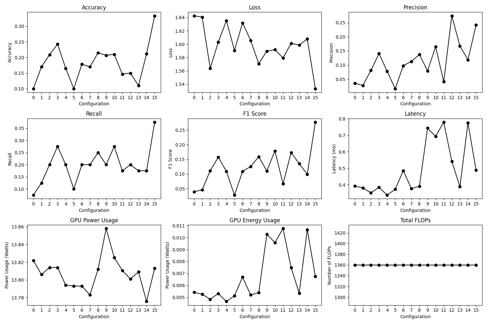

### Why is it unusual to sequence three linear layers consecutively without nonlinear activation functions?

When multiple linear layers are stacked together without any nonlinear activations in between, their combined effect is equivalent to that of a single linear layer. Mathematically, if you have three linear layers defined as L_1, L_2, and L_3 applying them consecutively to an input with no nonlinear activation, these layers could be represented as one L_4 layer. This does not add any additional complexity or learning capacity to the model beyond what a single linear layer could achieve.

### 1. Can you edit your code, so that we can modify the above network to have layers expanded to double their sizes? Note: you will have to change the ReLU also.

### 2. In lab3, we have implemented a grid search, can we use the grid search to search for the best channel multiplier value?

Code was implemented to plot the following graph by creating a search space. Training the new model and then retrieving the data.

The data in figure 1 shows...


*Figure 1: Metric Analysis of Different Quantization Configurations in the Model*

### 3. Can you then design a search so that it can reach a network that can have this kind of structure?

New Function:
```python
def redefine_linear_transform(graph, transform_args=None):
    config_main = transform_args
    default_config = config_main.pop('default', None)
    if default_config is None:
        raise ValueError("default configuration must be provided.")

    for index, node in enumerate(graph.fx_graph.nodes, start=1):
            node_config = config_main.get(node.name, default_config)['config']
            module_action = node_config.get("name")
            
            if module_action:
                original_module = graph.modules[node.target]
                in_features, out_features, bias = original_module.in_features, original_module.out_features, original_module.bias
                
                multiplier_in = node_config.get("channel_multiplier_in", 1)
                multiplier_out = node_config.get("channel_multiplier_out", node_config.get("channel_multiplier", 1))
                
                if module_action == "output_only":
                    out_features *= multiplier_out
                elif module_action == "both":
                    in_features *= multiplier_in
                    out_features *= multiplier_out
                elif module_action == "input_only":
                    in_features *= multiplier_in
                
                new_module = instantiate_linear(in_features, out_features, bias)
                parent_name, child_name = get_parent_name(node.target)
                setattr(graph.modules[parent_name], child_name, new_module)
        
    return graph, {}
```
Input:

```python
transform_args = {
    "by": "name",
    "default": {"config": {"name": None}},
    "seq_blocks_2": {"config": {"name": "output_only", "channel_multiplier_out": 2}},
    "seq_blocks_4": {"config": {"name": "both", "channel_multiplier_in": 2, "channel_multiplier_out": 4}},
    "seq_blocks_6": {"config": {"name": "input_only", "channel_multiplier_in": 4}},
}
```

Output:

```python
Original Graph:
Module number 0: BatchNorm1d(16, eps=1e-05, momentum=0.1, affine=True, track_running_stats=True)
Module number 1: ReLU(inplace=True)
Module number 2: Linear(in_features=16, out_features=16, bias=True)
Module number 3: ReLU(inplace=True)
Module number 4: Linear(in_features=16, out_features=16, bias=True)
Module number 5: ReLU(inplace=True)
Module number 6: Linear(in_features=16, out_features=5, bias=True)
Module number 7: ReLU(inplace=True)
Transformed Graph:
Module number 0: BatchNorm1d(16, eps=1e-05, momentum=0.1, affine=True, track_running_stats=True)
Module number 1: ReLU(inplace=True)
Module number 2: Linear(in_features=16, out_features=32, bias=True)
Module number 3: ReLU(inplace=True)
Module number 4: Linear(in_features=32, out_features=64, bias=True)
Module number 5: ReLU(inplace=True)
Module number 6: Linear(in_features=64, out_features=5, bias=True)
Module number 7: ReLU(inplace=True)
```

The enhanced function now facilitates non-uniform weight scaling.

### 4.

The deepcopy function is designed to create a new compound object, into which it recursively inserts copies of the objects found in the original. In contrast, a shallow copy creates a new compound object but inserts references to the original objects to the extent possible. More details can be found in the Python documentation: https://docs.python.org/3/library/copy.html.

The need for deepcopy arose during a process where the graph was to be amended by the specified channel multiplier. However, using shallow copy resulted in the layers being multiplied multiple times, such as 16 x 2 in the first loop, then leading to 32 x 2 in the next etc, which would cause a dimension error.

However, using deepcopy caused an error:

RuntimeError: Only Tensors created explicitly by the user (graph leaves) support the deepcopy protocol at the moment.  If you were attempting to deepcopy a module, this may be because of a torch.nn.utils.weight_norm usage, see https://github.com/pytorch/pytorch/pull/103001

Therefore, using a workaround the redefine_linear_transform_pass function was adapted.

# Check if the current node is a Linear layer and process accordingly.
if isinstance(actual_target, nn.Linear):
    ori_module = graph.modules[node.target]  # Original module before modification.
    # Retrieve in_features and out_features from the config, falling back to original module's attributes if not specified.
    in_features = config.get('in_features', ori_module.in_features)
    out_features = config.get('out_features', ori_module.out_features)
    bias = ori_module.bias  # Preserve the original bias setting.
    multiplier_out = config["channel_multiplier_out"]
    multiplier_in = config["channel_multiplier_in"]
    # Modify only the output features based on the channel multiplier.
    in_features *= multiplier_in
    out_features *= multiplier_out
    # Create a new Linear module with the updated features and replace the original module in the graph.
    new_module = instantiate_linear(in_features, out_features, bias)
    parent_name, name = get_parent_name(node.target)
    setattr(graph.modules[parent_name], name, new_module)