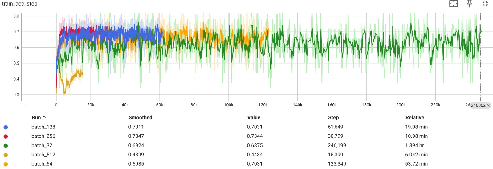
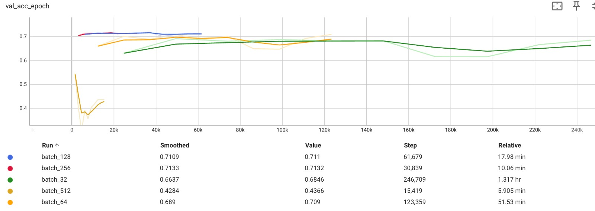
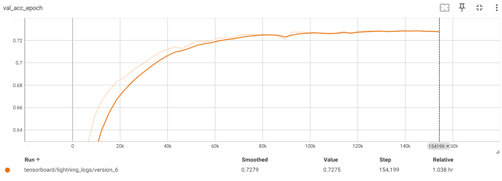

# Lab 1

Data was trained using a bash file see Run_Training_Models.sh for detail

### 1.  What is the impact of varying batch sizes and why?

The batchsize of a network is a very important hyperparameter. It represents the number of samples used in one forward and backwards pass of the network. Batch sizes of 32, 64, 128, 256 and 512 will be tested, with other parameters set as MASE's default. 


*Figure 1: Train Learning Curve with Different Batch Sizes*


*Figure 2: Validation Learning Curve with Different Batch Sizes*

The study on how batch size affects neural network performance reveals that extreme batch sizes significantly impact learning efficiency and accuracy. Figures 1 and 2 illustrate that a small batch size of 32 leads to the second lowest validation accuracy (66%) coupled with the longest training time (1.39 hr). Conversely, a large batch size of 512, while substantially reducing training time (6.04 min), results in a decrease in both training and validation accuracy, achieving only 42.8% in validation accuracy.

An optimal batch size seems to be 256, which yields the highest validation accuracy (71%) and the second shortest training duration (10.06 min). Figures 1 and 2 highlight the critical role of batch size adjustment. Varying the batch size can almost halve the validation error and reduce training times by 1308%. Therefore, choosing an optimal batch size is key to neural network success.

The batch size influences training time, as larger batch sizes enable more efficient use of resources like GPUs, which are optimized for parallel processing. However, excessively large batches can strain GPU memory, potentially leading to crashes or other issues.

Conversely, smaller batch sizes are often linked to better generalization since they provide noisier estimates of the gradient. This variance can sometimes hinder the learning process, but it also leads to better generalization. Studies have shown that smaller batch sizes tend to converge to flatter minima, while large batch sizes converge to sharp minima, which are associated with poorer generalization.

### 1.  What is the impact of varying maximum epoch number?

Epoch Number of 10, 20, 50 and 100 will be tested, using a learning rate of 0.001, with other parameters set as MASE's default.


*Figure 3: Train Learning Curve with Different Max Epochs*


*Figure 4: Validation Learning Curve with Different Max Epochs*

Figures 3 and 4 demonstrate that varying the final epoch number has a minimal effect on validation accuracy (Range: 0.016); despite slight variations, the results generally converge to a similar value. However, training times are significantly impacted. For instance, setting the epoch number to 100 leads to training of over 3.5 hours, without any improvement in validation accuracy compared with 5 epochs, which achieves similar accuracy in only 3.7 minutes.

Considering the maximum epoch number is crucial, as excessive computation not only increases costs but also risks overfitting the training data. Given the small size of this model and its limited dataset, training for numerous epochs is unnecessary and inefficient, as shown by the results of this test.

### 3.1. What is happening with a large learning and what is happening with a small learning rate and why?

Learning rates of 0.01, 0.001, 0.0001 and 0.00001 were tested, with other parameters set as MASE's default.


*Figure 5: Train Learning Curve with Different Learning Rates*


*Figure 6: Validation Learning Curve with Different Learning Rates*

Figures 5 and 6 illustrate a significant change between different learning rates. Notably, a smaller learning rate converges extremely slowly, resulting in the final validation and training accuracy being considerably lower than models with higher learning rates. As the max epoch was restricted to 20 in this test, the small learning rate model could reach the accuracies of other learning rates if the epoch number was increased. However, this would cause the training times to be excessive, with no accuracy benefit. All training times were similar, except for the smallest learning rate, which was considered an anomaly as the others varied little. Although training time doesn't change considerably with learning rate, a small learning rate might converge so slowly that it requires more epochs, thus increasing training time.

On the other hand, a high learning rate of 0.1 converged very quickly to a minimum, but it settled on a local minimum instead of a global one, evidenced by the low validation and training accuracy with no further convergence.

This test shows that the learning rate is crucial in determining the size of the step towards optimal weights. A large learning rate can overshoot the optimum solution, causing the optimizer to get stuck in a local minimum. Conversely, a small learning rate may lead to excessively slow convergence to an optimum. Ideally, the learning rate would continuously adapt to provide the best balance.

The Adam optimizer adjusts the learning rate during training; however, the initial learning rate still sets the scale of the updates. This means it can influence how quickly the optimizer converges to a solution or whether it converges at all.

A learning rate of 10e-3 demonstrated the best performance, with both fast convergence and the highest validation accuracy. This highlights the importance of selecting a suitable learning rate to ensure convergence to a global minimum while also balancing training time.

### 3.2. What is the relationship between learning rates and batch sizes?


*Figure 7: Train Learning Curve with Different Batch Sizes*


*Figure 8: Validation Learning Curve with Different Batch Sizes*

The relationship between batch size and learning rate is crucial in getting an optimum neural network. A smaller batch size often requires a lower learning rate to maintain stability due to the increased noise in gradient estimates, which can be beneficial for escaping local minima and improving generalization. Conversely, larger batch sizes provide more stable, but less noisy, gradient information, allowing for the use of higher learning rates and potentially faster convergence. However, this can sometimes lead to poorer generalization. The choice of batch size and learning rate also influences the computational efficiency of training. While larger batches are more computationally efficient due to better hardware utilization, they require careful tuning of the learning rate to avoid suboptimal training results. This interplay necessitates a balanced approach, often requiring empirical tuning to optimize model performance.

### 4.  Implement a network that has in total around 10x more parameters than the toy network.

Implemented Network:
```python
# Implemented Model
class JSC_Tiny_x10(nn.Module):
    def __init__(self, info):
        super(JSC_Tiny_x10, self).__init__()
        self.seq_blocks = nn.Sequential(
            # 1st Layer
            nn.BatchNorm1d(16),
            nn.ReLU(),
            nn.Linear(16, 40),  # Increased number of output features

            # Additional Layers
            nn.BatchNorm1d(40),
            nn.ReLU(),
            nn.Linear(40, 25),  # New layer

            # Final Layer
            nn.BatchNorm1d(25),
            nn.ReLU(),
            nn.Linear(25, 5),  # Output layer with 5 features as in the original model
        )

    def forward(self, x):
        return self.seq_blocks(x)

# Added getter
def get_jsc_x10(info):
    return JSC_Tiny_x10(info)

# Added to model to PHYSICAL_MODELS
"jsc-tiny-x10": {
    "model": get_jsc_x10,
    "info": MaseModelInfo(
        "jsc-s",
        model_source="physical",
        task_type="physical",
        physical_data_point_classification=True,
        is_fx_traceable=True,
    ),
```

### 5.  Test your implementation and evaluate its performance.


*Figure 9: Train Learning Curve with Different Batch Sizes*


*Figure 10: Validation Learning Curve with Different Batch Sizes*

*Table 1: Test Data Performance*
| Metric |   Tiny   | Tiny x10 |
|--------|----------|----------|
|  acc   | 0.716586 | 0.726731 |
| loss   | 0.846463 | 0.777506 |

Training for the X10 model was completed with a batch size of 256 and for 50 epochs, with all other parameters set to default. The Tiny model, used for comparison, was performed with only 20 epochs and a batch size of 256, with all other parameters set to default. It is important to note that, in either model, no hyperparameter was optimized.

Evaluating the larger model's test performance (see Table 1), we see that there is a slight improvement in accuracy. Additionally, Figures 9 and 10 demonstrate a considerably longer training time, as more epochs were used, paired with more computation due to more weights needing to be calculated and updated. Comparing the large model to the smaller tiny network, we observe a slightly lower error rate. The smaller model is not a great model for comparison as it uses fewer epochs; however, it does show that, without hyperparameter optimization, a considerably smaller model with fewer parameters and epochs can achieve similar accuracy to a model with 10 times the parameters. This demonstrates that machine learning engineers cannot just make models larger to improve accuracy but also have to optimize hyperparameters and model types, such as adding convolutional layers and changing network type.

Furthermore, Figure 10 demonstrates that the validation accuracy exhibits minimal improvement after 25 epochs, suggesting that implementing early stopping criteria could effectively reduce computation.

# Lab 2

### 1. Explain the functionality of `report_graph_analysis_pass` and its printed jargons such as `placeholder`, `get_attr` ... You might find the doc of [torch.fx](https://pytorch.org/docs/stable/fx.html) useful.

It is used to produce a report for the graph analysis of a MaseGraph. It takes a MaseGraph as an input and counts the different node operations and module types then returns a tuple of a MaseGraph and an empty dictionary of types of operations. 

The operations are defined as follows:

1. placeholder: Represents inputs to the model; 'name' assigns input names, 'target' names the argument, 'args' nothing or default parameter of function input, 'kwargs' unused.

2. get_attr: These nodes are used to fetch parameters from your model, such as weights from layers. They locate the parameters within the model’s structure. Fetches a parameter from the module hierarchy; 'name' labels the result, 'target' identifies the parameter's location in the hierarchy, 'args' and 'kwargs' are unused.

3. call_function: These nodes represent the application of standalone functions (like torch.add) on data. They keep track of the function being used and the arguments it takes. Applies a function to values; 'name' labels the result, 'target' is the function, 'args' and 'kwargs' are the function's arguments, following Python's convention

4. call_module: These are used when a specific module (a layer in the neural network) is called. 'name' labels the result, 'target' is the module's location in the hierarchy, 'args' and 'kwargs' are arguments excluding 'self'.

5. call_method: Similar to Call_Function, but these nodes are for methods that belong to an object (like tensor.view()). They record the method being called, including the object it is called on (self) and other arguments. 'name' for labeling, 'target' is the method's name, 'args' and 'kwargs' include all method arguments including 'self'.

6. output: Correspond to the return values of functions or the final output of your model.

The function appends a network overview and layer types information to the buffer.

### 2. What are the functionalities of `profile_statistics_analysis_pass` and `report_node_meta_param_analysis_pass` respectively?

### profile_statistics_analysis_pass
Function performs a series of operations on a given graph section to collect profile and computes statistics (See Below) related to the weights and activations of the nodes metadata.

#### Arguments:
Graph Node Identification by Name: Targets nodes in the graph whose names match entries in target_weight_nodes or target_act_nodes for statistical analysis.

Targeting by Type or Attribute: Uses a common characteristic, defined by mase_op, to identify nodes for analysis; applicable for various operation types like convolution, pooling, etc.

target_weight_nodes: Specifies which weight layers' data should be recorded for statistical analysis.

target_act_nodes: Designates activation nodes to record statistics for.

weight_stats: Determines the type of statistics to be collected for weight nodes.

act_stats: Defines dimensions, quantile, and device for activation statistics collection.

#### Statistics:
Record: Keeps a record of all samples passed to it. It allows for samples to be moved to a specific device and adds a new dimension before concatenation if required.

VarianceOnline: Calculates the running variance and mean using Welford's online algorithm, which is more memory-efficient as it does not require storing all samples.

VariancePrecise: Computes the variance and mean by concatenating samples and using torch.var and torch.mean. It is more precise but uses more memory, which can be significant for large datasets.

RangeNSigma: Determines the range of samples within n standard deviations (sigma) from the mean. It assumes a normal distribution and can operate in either 'precise' or 'online' mode for variance calculation.

RangeMinMax: Calculates the range of samples based on the minimum and maximum values. It can also take the absolute value of samples before calculation.

RangeQuantile: Computes the range based on quantiles. It can take the absolute values of samples and reduce along specified dimensions.

AbsMean: Implements an online algorithm to compute the mean of the absolute values of the samples.

### report_node_meta_param_analysis_pass

Report Generation: Constructs a table with headers based on selected parameter categories:

Includes basic information like node name, operation type (Fx Node op), and Mase type and Mase op.

"which": Specifies which categories of parameters to include in the report (options: "all", "common", "hardware", "software").

"save_path": Defines a file path where the analysis report will be saved.

### 3. Explain why only 1 OP is changed after the `quantize_transform_pass`.

As only one call_module type (Linear) is being specified to be quantized in the transform pass, additionally, in the JSC-Tiny model, there is one linear operator. If ReLU were chosen to be quantized, then there would be 2 changes.

### 4. Write some code to traverse both `mg` and `ori_mg`, check and comment on the nodes in these two graphs. You might find the source code for the implementation of `summarize_quantization_analysis_pass` useful.

```python
from chop.ir.graph.mase_graph import MaseGraph
from chop.passes.graph.utils import get_mase_op, get_mase_type, get_node_actual_target
import torch

# Iterate over pairs of nodes from the original and modified graphs
for ori_n, n in zip(ori_mg.fx_graph.nodes, mg.fx_graph.nodes):
    # Check if the node's target module has changed type after modification
    if type(get_node_actual_target(n)) != type(get_node_actual_target(ori_n)):
        
        # Retrieve the original and quantized modules from the nodes
        ori_module = get_node_actual_target(ori_n)
        quant_module = get_node_actual_target(n)
        
        # Print the difference information
        print(f'Difference found at name: {n.name}, '
              f'MASE type: {get_mase_type(n)}, MASE operation: {get_mase_op(n)}\n'
              f'Original module: {type(ori_module)} --> '
              f'New module: {type(quant_module)}')

        # Print the weights of the original and quantized modules
        print(f'Weight of original module: {ori_module.weight}')
        print(f'Weights of quantized module: {quant_module.get_quantized_weight()}')

        # Generate a random input tensor based on the input feature size of the quantized module
        test_input = torch.randn(quant_module.in_features)
        print(f'Random generated test input: {test_input}')
        # Apply the original and quantized modules to the test input and print the outputs
        print(f'Output for original module: {ori_module(test_input)}')
        print(f'Output for quantized module: {quant_module(test_input)}')

```

### 5. Perform the same quantisation flow to the bigger JSC network that you have trained in lab1. You must be aware that now the `pass_args` for your custom network might be different if you have used more than the `Linear` layer in your network.

```python
# Define batch size and model specifications
batch_size = 8
model_name = "jsc-tiny-x10"
dataset_name = "jsc"

# Initialize the data module with specified parameters
data_module = MaseDataModule(
    name=dataset_name,
    batch_size=batch_size,
    model_name=model_name,
    num_workers=0,
)
data_module.prepare_data()
data_module.setup()

# Retrieve model information and initialize the model
# Assuming get_model_info and get_model functions are pre-defined
model_info = get_model_info(model_name)
model = get_model(
    model_name,
    task="cls",
    dataset_info=data_module.dataset_info,
    pretrained=False
)

# Load the model from a checkpoint file
model = load_model(
    load_name="../mase_output/Lab_Output_My_Model_50_Epoch/software/training_ckpts/best-v5.ckpt",
    load_type="pl",
    model=model
)

# Initialize the input generator for the model
input_generator = InputGenerator(
    data_module=data_module,
    model_info=model_info,
    task="cls",
    which_dataloader="train",
)

# Generate the Mase graph and initialize node metadata
mg = MaseGraph(model=model)
mg, _ = init_metadata_analysis_pass(mg, None)
mg, _ = add_common_metadata_analysis_pass(mg, {"dummy_in": dummy_in})
mg, _ = add_software_metadata_analysis_pass(mg, None)

# Run the report graph analysis pass for detailed graph information
from chop.passes.graph import report_graph_analysis_pass
_ = report_graph_analysis_pass(mg)

# Define arguments for profiling node statistics in the model
pass_args = {
    "by": "type",
    "target_weight_nodes": ["linear"],
    "target_activation_nodes": ["relu"],
    "weight_statistics": {
        "variance_precise": {"device": "cpu", "dims": "all"},
    },
    "activation_statistics": {
        "range_quantile": {"device": "cpu", "dims": "all", "quantile": 0.97}
    },
    "input_generator": input_generator,
    "num_samples": 32,
}

# Perform profiling and report on node metadata and parameters
mg, _ = profile_statistics_analysis_pass(mg, pass_args)
mg, _ = report_node_meta_param_analysis_pass(mg, {"which": ("software",)})
```
See evidence for working code in the next question.
### 6. Write code to show and verify that the weights of these layers are indeed quantised. You might need to go through the source code of the implementation of the quantisation pass and also the implementation of the [Quantized Layers](../../machop/chop/passes/transforms/quantize/quantized_modules/linear.py).

Added this function in the linear.py file within the LinearBase class
```python 
def get_quantized_weight(self) -> Tensor:
    return self.w_quantizer(self.weight)
```
```python
from chop.ir.graph.mase_graph import MaseGraph
from chop.passes.graph.utils import get_mase_op, get_mase_type, get_node_actual_target
import torch

# Iterate over pairs of nodes from the original and modified graphs
for ori_n, n in zip(ori_mg.fx_graph.nodes, mg.fx_graph.nodes):
    # Check if the node's target module has changed type after modification
    if type(get_node_actual_target(n)) != type(get_node_actual_target(ori_n)):
        
        # Retrieve the original and quantized modules from the nodes
        ori_module = get_node_actual_target(ori_n)
        quant_module = get_node_actual_target(n)
        
        # Print the difference information and print the first weights of each module
        print(f'Difference found at name: {n.name}, '
              f'MASE type: {get_mase_type(n)}, MASE operation: {get_mase_op(n)}\n'
              f'Original module: {type(ori_module)}, Old Non Quantized Weights: {ori_module.weight[0:1]} --> '
              f'New module: {type(quant_module)}, New Quantized Weights: {quant_module.get_quantized_weight()[0:1]}')
        
        ### NOTE: Can print complete weights by removing the [0:1] from the print statements above ###
        # # Print the weights of the original and quantized modules
        # print(f'Weight of original module: {ori_module.weight}')
        # print(f'Weights of quantized module: {quant_module.get_quantized_weight()}')
        
        ### NOTE: Can compare output of original and quantised module ###
        # # Generate a random input tensor based on the input feature size of the quantized module
        # test_input = torch.randn(quant_module.in_features)
        # print(f'Random generated test input: {test_input}')
        # # Apply the original and quantized modules to the test input and print the outputs
        # print(f'Output for original module: {ori_module(test_input)}')
        # print(f'Output for quantized module: {quant_module(test_input)}')
```

This code outputs: 
``` python
Difference found at name: seq_blocks_2, MASE type: module_related_func, MASE operation: linear
Original module: <class 'torch.nn.modules.linear.Linear'>, Old Non Quantized Weights: tensor([[-0.0312,  0.1250, -0.0923, -0.2323, -0.0515,  0.1775, -0.0179,  0.1851,
         -0.0339,  0.0698, -0.0141,  0.0019, -0.2413, -0.1191, -0.2104, -0.0343]],
       grad_fn=<SliceBackward0>) --> New module: <class 'chop.passes.graph.transforms.quantize.quantized_modules.linear.LinearInteger'>, New Quantized Weights: tensor([[-0.0000,  0.1250, -0.0625, -0.2500, -0.0625,  0.1875, -0.0000,  0.1875,
         -0.0625,  0.0625, -0.0000,  0.0000, -0.2500, -0.1250, -0.1875, -0.0625]],
       grad_fn=<SliceBackward0>)
Difference found at name: seq_blocks_5, MASE type: module_related_func, MASE operation: linear
Original module: <class 'torch.nn.modules.linear.Linear'>, Old Non Quantized Weights: tensor([[ 0.0497, -0.0559,  0.0175, -0.0045,  0.0795,  0.1399, -0.1013, -0.0333,
          0.0246,  0.0914, -0.0778, -0.1215,  0.0155,  0.1367, -0.0362, -0.2130,
          0.1124, -0.1671, -0.0646, -0.0880,  0.0124,  0.0092, -0.0666,  0.0286,
         -0.1770, -0.0771, -0.0248,  0.1295, -0.0093, -0.0011, -0.1092, -0.0055,
         -0.0741, -0.0980,  0.1860, -0.0968, -0.0452,  0.0878,  0.0946,  0.1057]],
       grad_fn=<SliceBackward0>) --> New module: <class 'chop.passes.graph.transforms.quantize.quantized_modules.linear.LinearInteger'>, New Quantized Weights: tensor([[ 0.0625, -0.0625,  0.0000, -0.0000,  0.0625,  0.1250, -0.1250, -0.0625,
          0.0000,  0.0625, -0.0625, -0.1250,  0.0000,  0.1250, -0.0625, -0.1875,
          0.1250, -0.1875, -0.0625, -0.0625,  0.0000,  0.0000, -0.0625,  0.0000,
         -0.1875, -0.0625, -0.0000,  0.1250, -0.0000, -0.0000, -0.1250, -0.0000,
         -0.0625, -0.1250,  0.1875, -0.1250, -0.0625,  0.0625,  0.1250,  0.1250]],
       grad_fn=<SliceBackward0>)
Difference found at name: seq_blocks_8, MASE type: module_related_func, MASE operation: linear
Original module: <class 'torch.nn.modules.linear.Linear'>, Old Non Quantized Weights: tensor([[-0.3195, -0.0037, -0.2968,  0.0584,  0.1211,  0.2713,  0.1203, -0.0250,
         -0.1020, -0.0727, -0.0265,  0.2700, -0.2691,  0.3053, -0.2221,  0.3354,
         -0.1450, -0.0420, -0.2243, -0.2594, -0.0766,  0.3295, -0.1473,  0.1601,
         -0.2462]], grad_fn=<SliceBackward0>) --> New module: <class 'chop.passes.graph.transforms.quantize.quantized_modules.linear.LinearInteger'>, New Quantized Weights: tensor([[-0.3125, -0.0000, -0.3125,  0.0625,  0.1250,  0.2500,  0.1250, -0.0000,
         -0.1250, -0.0625, -0.0000,  0.2500, -0.2500,  0.3125, -0.2500,  0.3125,
         -0.1250, -0.0625, -0.2500, -0.2500, -0.0625,  0.3125, -0.1250,  0.1875,
         -0.2500]], grad_fn=<SliceBackward0>)
```
The results show that the weights are quantized.
### 7.  Load your own pre-trained JSC network, and perform perform the quantisation using the command line interface.

Entering the command:
./ch transform \--config configs/examples/jsc_toy_by_type.toml \--task

The output is:
``` python
+-------------------------+--------------------------+--------------+-----------------+--------------------------+
| Name                    |         Default          | Config. File | Manual Override |        Effective         |
+-------------------------+--------------------------+--------------+-----------------+--------------------------+
| task                    |      classification      |     cls      |       cls       |           cls            |
| load_name               |           None           |              |                 |           None           |
| load_type               |            mz            |              |                 |            mz            |
| batch_size              |           128            |     512      |                 |           512            |
| to_debug                |          False           |              |                 |          False           |
| log_level               |           info           |              |                 |           info           |
| report_to               |       tensorboard        |              |                 |       tensorboard        |
| seed                    |            0             |      42      |                 |            42            |
| quant_config            |           None           |              |                 |           None           |
| training_optimizer      |           adam           |              |                 |           adam           |
| trainer_precision       |         16-mixed         |              |                 |         16-mixed         |
| learning_rate           |          1e-05           |     0.01     |                 |           0.01           |
| weight_decay            |            0             |              |                 |            0             |
| max_epochs              |            20            |      5       |                 |            5             |
| max_steps               |            -1            |              |                 |            -1            |
| accumulate_grad_batches |            1             |              |                 |            1             |
| log_every_n_steps       |            50            |      5       |                 |            5             |
| num_workers             |            8             |              |        0        |            0             |
| num_devices             |            1             |              |                 |            1             |
| num_nodes               |            1             |              |                 |            1             |
| accelerator             |           auto           |     gpu      |                 |           gpu            |
| strategy                |           auto           |              |                 |           auto           |
| is_to_auto_requeue      |          False           |              |                 |          False           |
| github_ci               |          False           |              |                 |          False           |
| disable_dataset_cache   |          False           |              |                 |          False           |
| target                  |   xcu250-figd2104-2L-e   |              |                 |   xcu250-figd2104-2L-e   |
| num_targets             |           100            |              |                 |           100            |
| is_pretrained           |          False           |              |                 |          False           |
| max_token_len           |           512            |              |                 |           512            |
| project_dir             | /home/laurie2905/mase/ma |              |                 | /home/laurie2905/mase/ma |
|                         |        se_output         |              |                 |        se_output         |
| project                 |           None           | jsc-tiny-TPE |                 |       jsc-tiny-TPE       |
| model                   |           None           |   jsc-tiny   |                 |         jsc-tiny         |
| dataset                 |           None           |     jsc      |                 |           jsc            |
+-------------------------+--------------------------+--------------+-----------------+--------------------------+
INFO     Initialising model 'jsc-tiny'...
INFO     Initialising dataset 'jsc'...
INFO     Project will be created at /home/laurie2905/mase/mase_output/jsc-tiny-TPE
INFO     Transforming model 'jsc-tiny'...
INFO     Quantized graph histogram:
INFO     
| Original type   | OP           |   Total |   Changed |   Unchanged |
|-----------------+--------------+---------+-----------+-------------|
| BatchNorm1d     | batch_norm1d |       1 |         0 |           1 |
| Linear          | linear       |       1 |         1 |           0 |
| ReLU            | relu         |       2 |         0 |           2 |
| output          | output       |       1 |         0 |           1 |
| x               | placeholder  |       1 |         0 |           1 |
INFO     Saved mase graph to /home/laurie2905/mase/mase_output/jsc-tiny-TPE/software/transform/transformed_ckpt
INFO     Transformation is completed
``` 
### 8. \[Optional\] Write your own pass

```python
# Import necessary libraries
import os
import torch
from chop.ir.graph.mase_graph import MaseGraph
from chop.passes.graph.utils import get_node_actual_target
from chop.passes.graph.analysis.quantization import calculate_flops_pass

# Change the current working directory to the parent directory and then into 'machop'
os.chdir('../machop')

def calculate_flops_mg_pass(mase_graph):
    """
    Calculates the FLOPs (Floating Point Operations) for each module in a MaseGraph.

    Args:
        mase_graph (MaseGraph): The graph representing the model for which FLOPs are calculated.

    Returns:
        tuple: The original graph and a dictionary containing the FLOPs calculation breakdown and total FLOPs.
    """
    # Dictionary to store FLOPs calculation for each module
    flops_breakdown = {}
    # Initialize total FLOPs count
    total_flops = 0
    
    # Iterate through each node in the MaseGraph
    for node in mase_graph.fx_graph.nodes:
        try:
            # Try to extract input data shape from node metadata
            input_data_shape = (node.meta['mase'].parameters['common']['args']['data_in_0']['value'],)
        except KeyError:
            # If input data shape is not found, set it as None
            input_data_shape = (None,)
        
        # Extract output data shape from node metadata
        output_data_shape = (node.meta['mase'].parameters['common']['results']['data_out_0']['value'],)

        # Get the actual PyTorch module associated with the node
        module = get_node_actual_target(node)
        
        # Check if the node is a PyTorch module to calculate FLOPs
        if isinstance(module, torch.nn.Module):
            # Calculate FLOPs for the module
            module_flops = calculate_flops_pass(module, input_data_shape, output_data_shape)
            # Store module FLOPs in the breakdown dictionary
            flops_breakdown[module] = module_flops
            # Accumulate total FLOPs
            total_flops += module_flops['computations']

    # Print FLOPs calculation breakdown and total FLOPs
    print("FLOPs Calculation Breakdown: ", flops_breakdown)
    print("\nTotal FLOPs: ", total_flops)

    # Return the original graph and FLOPs calculation results
    return mase_graph, {"flop_module_breakdown": flops_breakdown, "total_flops": total_flops}

calculate_flops_mg_pass(ori_mg)
```

Function to count FLOPs for a given PyTorch Module:

```python
import numpy as np
import torch 

def calculate_flops_pass(module, in_data, out_data):
    """
    Calculates FLOPs for a given PyTorch module.
    
    Args:
        module: The PyTorch module to analyze.
        in_data: Input tensor(s) to the module.
        out_data: Output tensor(s) from the module.
        
    Returns:
        A dictionary with keys 'total_parameters', 'computations', 'backward_computations',
        'input_buffer_size', and 'output_buffer_size' detailing the computational cost of the module.
    """

    # Handle Adaptive Average Pooling 2D layer
    if isinstance(module, torch.nn.AdaptiveAvgPool2d):
        # Ensure there is exactly one input tensor
        assert len(in_data) == 1  
        # Calculate total elements in the input and output
        input_size = in_data[0].numel()  
        output_size = out_data[0].numel()  
        # Computations are equal to the number of input elements since it averages over spatial dimensions
        computations = input_size  
        backward_computations = input_size  # Backward pass computations equal to forward pass
        # Return a dictionary summarizing the computational cost
        return {
            "total_parameters": 0,  # No learnable parameters in AdaptiveAvgPool2d
            "computations": computations,
            "backward_computations": backward_computations,
            "input_buffer_size": input_size,
            "output_buffer_size": output_size,
        }

    # Handle Embedding layer
    elif isinstance(module, torch.nn.Embedding):
        # Total learnable parameters are the product of embedding dimensions and number of embeddings
        total_parameters = module.embedding_dim * module.num_embeddings  
        return {
            "total_parameters": total_parameters,
            "computations": 0,
            "backward_computations": 0,
            "input_buffer_size": 0,  
            "output_buffer_size": 0,
        }

    # Handle Average Pooling 2D and Max Pooling 2D layers
    elif isinstance(module, (torch.nn.AvgPool2d, torch.nn.MaxPool2d)):
        # Calculate the kernel window size for pooling operations
        window_size = module.kernel_size**2 if type(module.kernel_size) == int else module.kernel_size[0] * module.kernel_size[1]
        assert len(out_data) == 1  # Ensure single output tensor
        input_size = in_data[0].numel()
        output_size = out_data[0].numel()
        # For pooling layers, each output element involves computations over the window size of input elements
        computations = output_size * window_size
        backward_computations = input_size * window_size
        return {
            "total_parameters": 0,  # Pooling layers have no learnable parameters
            "computations": computations,
            "backward_computations": backward_computations,
            "input_buffer_size": input_size,
            "output_buffer_size": output_size,
        }

    # Handle Convolutional 2D layer
    elif isinstance(module, torch.nn.Conv2d):
        # Calculate the convolutional window size, taking into account the number of input channels
        _, channels, _, _ = in_data.size()
        window_size = module.kernel_size[0] * module.kernel_size[1] * channels
        input_size = in_data[0].numel()
        output_size = out_data[0].numel()
        # Computations for a Conv2d layer involve multiplying the window size by the number of output elements
        computations = output_size * window_size
        backward_computations = input_size * window_size * 2  # Backward pass computations are double of forward pass
        return {
            "total_parameters": module.weight.numel(),  # Only weight parameters, bias excluded for simplicity
            "computations": computations,
            "backward_computations": backward_computations,
            "input_buffer_size": input_size,
            "output_buffer_size": output_size,
        }

# Handle Dropout layers (both 2D and standard Dropout)
    elif isinstance(module, (torch.nn.Dropout2d, torch.nn.Dropout)):
        # Dropout does not add computational cost in terms of FLOPs as it is a 
        # simple pass-through that randomly sets input units to 0 during training.
        # No parameters to learn.
        return {
            "total_parameters": 0,
            "computations": 0,
            "backward_computations": 0,
            "input_buffer_size": in_data[0].numel(),
            "output_buffer_size": out_data[0].numel(),
        }

    # Handle Linear (Fully Connected) layers
    elif isinstance(module, torch.nn.Linear):
        # The number of computations for a linear layer is determined by the matrix multiplication
        # between the input and the weight matrix, plus the addition of the bias for each output unit.
        # Compute the batch size based on input dimensions.
        batch_size = in_data[0].shape[0]
        # Computations involve multiplication and addition for each element in the weight matrix, for each batch element.
        computations = module.in_features * module.out_features * batch_size
        # If bias is used, add additional operations for the bias addition.
        if module.bias is not None:
            computations += module.out_features * batch_size
        # Backward computations are typically double the forward computations due to the gradient calculations.
        backward_computations = computations * 2
        return {
            "total_parameters": module.weight.numel() + (module.bias.numel() if module.bias is not None else 0),
            "computations": computations,
            "backward_computations": backward_computations,
            "input_buffer_size": in_data[0].numel(),
            "output_buffer_size": out_data[0].numel(),
        }

    # Handle ReLU and ReLU6 activation layers
    elif isinstance(module, (torch.nn.ReLU, torch.nn.ReLU6)):
        # ReLU and ReLU6 activations perform a simple comparison operation for each input element.
        # No learnable parameters.
        # The computation cost is equal to the number of input elements as each element is processed individually.
        return {
            "total_parameters": 0,
            "computations": in_data[0].numel(),
            "backward_computations": in_data[0].numel(),  # Assuming the backward pass has the same computational cost.
            "input_buffer_size": in_data[0].numel(),
            "output_buffer_size": out_data[0].numel(),
        }

    # Handle Layer Normalization
    elif isinstance(module, torch.nn.LayerNorm):
        # Layer Normalization involves computation for normalization and then scaling and shifting.
        # No FLOPs for lookup operations, but the normalization process involves calculations across the normalized dimensions.
        # Assuming 5 operations per element: subtraction, division, multiplication (by gamma), addition (of beta), and the computation of mean/variance.
        computations = in_data[0].numel() * 5
        return {
            "total_parameters": module.weight.numel() + module.bias.numel(),
            "computations": computations,
            "backward_computations": computations,  # Assuming backward pass involves a similar number of operations.
            "input_buffer_size": in_data[0].numel(),
            "output_buffer_size": out_data[0].numel(),
        }

    # Handle Batch Normalization for both 1D and 2D layers
    elif isinstance(module, (torch.nn.BatchNorm2d, torch.nn.BatchNorm1d)):
        # Batch Normalization involves normalization steps similar to LayerNorm, but applied per feature map/channel.
        # Computations involve the mean and variance calculation, normalization, and then scaling and shifting.
        computations = in_data[0].numel() * 4  # Simplified to 4 operations per element
        return {
            "total_parameters": module.weight.numel() + module.bias.numel(),  # Learnable parameters are scale (gamma) and shift (beta)
            "computations": computations,
            "backward_computations": computations,  # Assuming backward pass involves a similar number of operations.
            "input_buffer_size": in_data[0].numel(),
            "output_buffer_size": out_data[0].numel(),
        }

    else:
        # Print a message for unsupported module types. Custom layers or specific types not handled here will fall into this case.
        print("Unsupported module type for analysis:", type(module))
```

When calculating FLOPs (Floating Point Operations per Second) manually in the context of a neural network, the process can offer a more accurate estimation of the computational complexity of the network compared to empirical FLOPS measurement during actual runtime. This accuracy is due to the manual calculation taking into account the exact architecture of the neural network. Manual calculation allows for a precise accounting of all the mathematical operations required for a forward or backwards pass  through the network.

Measuring FLOPS empirically during runtime involves running the network on specific hardware and observing the actual computational performance. This method can be influenced by factors unrelated to the network's inherent complexity, such as hardware efficiency, software optimization, background processes, and the overhead of moving data between memory and processing units. These factors can lead to a measurement that reflects not just the complexity of the neural network, but also the performance characteristics of the specific runtime environment, which may not scale linearly with network complexity or might not be applicable across different hardware platforms.

Therefore, manual calculation of FLOPs for a neural network is considered more accurate for understanding the network's computational complexity.

There are packages which do the manual method automatically, but are either inaccurate or do not measure the backwards pass.

https://detectron2.readthedocs.io/en/latest/modules/fvcore.html
https://github.com/sovrasov/flops-counter.pytorch/tree/master/ptflops
https://github.com/1adrianb/pytorch-estimate-flops

Some examples of empirical measurement packages are:

https://icl.utk.edu/papi/
https://docs.nvidia.com/deeplearning/frameworks/dlprof-user-guide/