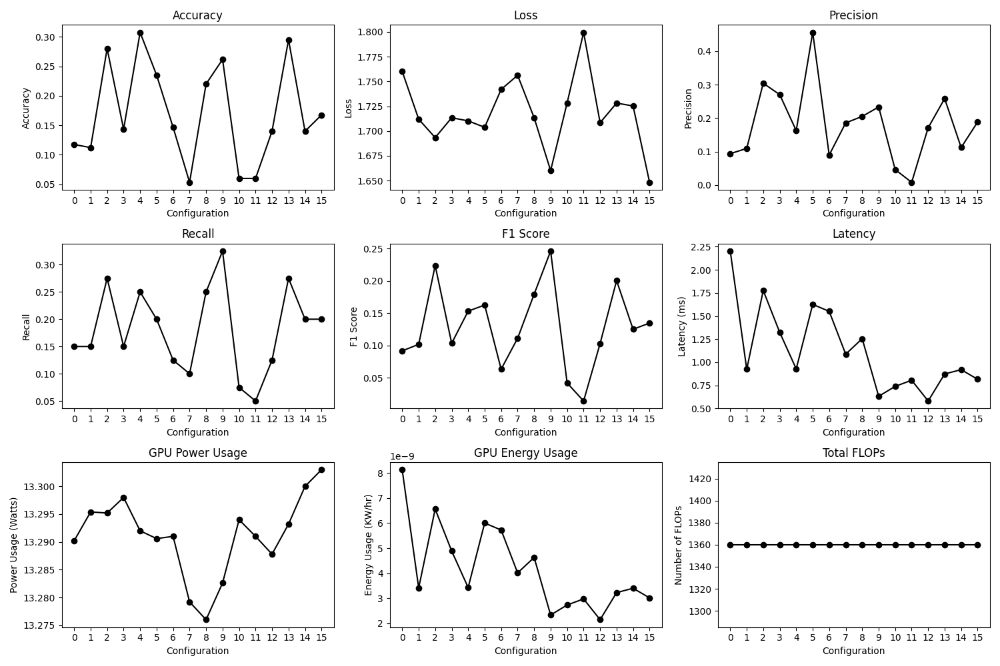
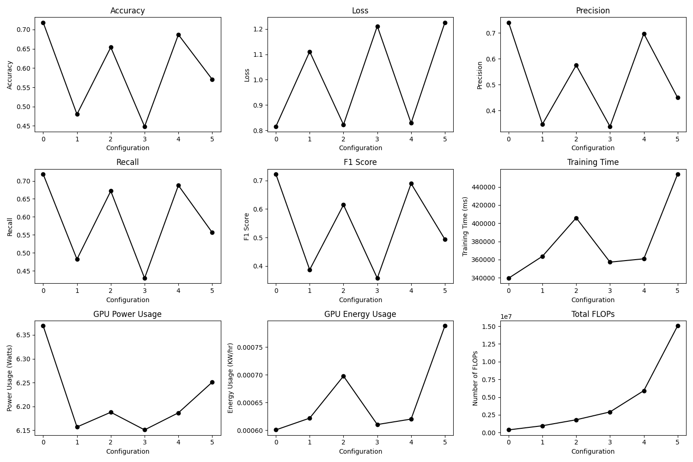

# Lab 3

### 1. Explore additional metrics that can serve as quality metrics for the search process. For example, you can consider metrics such as latency, model size, or the number of FLOPs (floating-point operations) involved in the model.

- Precision and Recall

Precision: The ratio of true positive predictions to the total number of positive predictions (including false positives).
Recall: The ratio of true positive predictions to the actual number of positive cases.

Usefulness: These metrics are crucial when dealing with imbalanced datasets. Precision is important when false positives are costly (email spam detection), while recall is important when false negatives carry higher risk (disease detection).

- F1 Score

Formula:

```
                Precision * Recall
 F1 Score = 2 * ------------------
                Precision + Recall
```

Description: The F1-score metric combines precision and recall, as indicated by its formula. A high F1 score signifies both high precision and recall. This metric is particularly valuable in situations where finding a balance between precision and recall is crucial, such as in document classification. While the F1 score provides a single metric for comparing classifiers, it could obscure large differences in precision or recall, as it assigns equal weight to both. In cases where it is imperative to minimize false positives or negatives, using precision and recall metrics separately may be more appropriate.

- GPU Energy Consumption

Description: The energy required by GPUs for training or inference processes is becoming increasingly important for sustainable AI development, especially in scenarios with limited power resources like mobile devices. Large Language Models, such as OpenAI's ChatGPT, often require substantial power for training, estimated at around 10 GWh, equivalent to the average yearly consumption of 1,000 households. Additionally, with the extensive use of ChatGPT, resulting in hundreds of millions of queries, the daily energy consumption is estimated to be equivalent to 1 GWh, or the daily usage of 33,000 households. Consequently, it is crucial to make concerted efforts in reducing the energy consumption of these models to enhance the sustainability of AI technologies

https://www.washington.edu/news/2023/07/27/how-much-energy-does-chatgpt-use/

- Latency

 Latency is a critical factor for neural networks during both the backward and forward passes. Measuring latency provides an estimate of the speed at which a neural network can deliver results upon receiving inputs. This aspect is crucial in numerous fields, such as high-frequency trading and autonomous driving. Latency can determine the feasibility of a model in specific scenarios. For instance, in autonomous driving, a neural network that outputs results with a delay of one second could potentially lead to a car crash. Moreover, the duration required for a model to process inputs and update weights significantly impacts training efficiency. A model that can train more rapidly not only consumes less energy but may also reach an optimal solution faster compared to one with higher latency.

### 2.1. Implement some of these additional metrics and attempt to combine them with the accuracy or loss quality metric.

Metrics Implemented:

- GPU energy consumption
- FLOPs
- Precision
- Recall
- F1 Score
- Latency

Reviewing figure 1, we observe that GPU power is relatively constant. In the developed system, GPU power measurement is executed through a threading-based approach, enabling the concurrent monitoring of GPU power usage alongside other computational tasks, such as model inference. However, the relatively short latency of the model's execution presents a significant challenge for capturing accurate and continuous power measurements. This difficulty arises primarily due to the sampling frequency limitations imposed by the utilized monitoring package (pynvml), which may not be sufficiently high to capture detailed power usage data. However, this approach could yield more accurate results in scenarios with longer inference durations or during the model training phases, where the extended periods provide a better opportunity for detailed power consumption analysis.

It's interesting to note that FLOPs do not change with quantization because the number of mathematical operations remains the same despite quantization. If there was time, implementing an analysis of the number of Bit operations would likely show a change with quantization.

Given that the quantization was applied to a small model with limited accuracy, the insights from the graph are somewhat constrained. However, these metrics could be valuable for analyzing more complex, trained neural networks in the future.


*Figure 1: Metric Analysis of Different Quantization Configurations in the Model*

### 2.2.  It’s important to note that in this particular case, accuracy and loss actually serve as the same quality metric (do you know why?).

When the output of your model (predictions) represents a probability distribution across classes, the cross-entropy loss function prompts the model to assign a high probability to the correct class. As the model improves in this aspect (i.e., as the loss decreases), it increasingly assigns the highest probability to the correct class, thus enhancing the accuracy.

Therefore, in scenarios where the model's predictions are probabilities and the task involves predicting the class with the highest probability, a decrease in cross-entropy loss often correlates with an increase in accuracy. While these metrics measure different aspects, they both serve as proxies for model performance in terms of classification accuracy.

### 3. Implement the brute-force search as an additional search method within the system, this would be a new search strategy in MASE.

In jsc_toy_by_type.toml file the sampler was changed to "brute_force"
``` python
# Change to reflect brute force method
# sampler = "tpe"
sampler = "brute_force"
```

In optuner.py file the optuna bruteforce sampler was added
``` python
def sampler_map(self, name):
    match name.lower():
        case "random":
            sampler = optuna.samplers.RandomSampler()
        case "tpe":
            sampler = optuna.samplers.TPESampler()
        case "nsgaii":
            sampler = optuna.samplers.NSGAIISampler()
        case "nsgaiii":
            sampler = optuna.samplers.NSGAIIISampler()
        case "qmc":
            sampler = optuna.samplers.QMCSampler()
        case "brute_force":
            sampler = optuna.samplers.BruteForceSampler()
        case _:
            raise ValueError(f"Unknown sampler name: {name}")
    return sampler
``` 

### 4. Compare the brute-force search with the TPE based search, in terms of sample efficiency. Comment on the performance difference between the two search methods.

Sample efficiency refers to how efficiently each method explores the search space and finds optimal solutions with a limited number of samples or iterations.

By running the Sample_Efficiency.py file, we conduct 50 runs of both brute force and TPE-based methods for a constant number of trials. When measuring the time, it is observed that the computation times for each method are similar. However, unlike the BruteForceSampler, the TPESampler doesn't exhaustively try all combinations. Instead, it intelligently samples the hyperparameter space based on the results of previous trials. In each trial, it uses a probabilistic model to predict which hyperparameters are likely to yield better results. Thus, if you set 200 trials in the TPESampler, it will perform 200 different experiments, each time updating its understanding and refining the hyperparameter space to find the optimal settings. In the Brute-Force approach, the number of trials will be limited by the possible number of combinations. This test was conducted to investigate if there was a difference in computation time per trial.

### Average computation time for 18 trials:

Brute-Force Search: 18.39 seconds

TPE-Based Search: 18.01 seconds

This result doesn't necessarily mean that there is no difference in sample efficiency between the two samplers. As discussed, the TPE sampler intelligently selects the hyperparameter space, so the TPESampler is more useful when dealing with a large and complex hyperparameter space where an exhaustive search is impractical or computationally expensive. In the search space defined in the original TOML file, the total number of possible combinations is small, being only 18. With a small number of combinations, the advanced probabilistic modeling of the TPESampler will not provide significant advantages over the complete search that the BruteForceSampler offers.

Expanding the search space to an infeasible number of computations makes it impossible for the BruteForce sampler to try all combinations. By logging and plotting the results using Lab3TPEGraph.py, as shown in Figure 2, it becomes evident that the TPE sampler selects a hyperparameter set that yields optimum results early on. In comparison, the brute force approach fails to find this combination within the allotted number of trials, demonstrating the TPE's advantage when dealing with a significant search space.


*Figure 2: Evaluating the Performance of Tree-structured Parzen Estimator (TPE) Versus Brute Force Method in Hyperparameter Sampling*

# Lab 4

### Why is it unusual to sequence three linear layers consecutively without nonlinear activation functions?

When multiple linear layers are stacked together without any nonlinear activations in between, their combined effect is equivalent to that of a single linear layer. Mathematically, if you have three linear layers defined as L_1, L_2, and L_3 applying them consecutively to an input with no nonlinear activation, these layers could be represented as one L_4 layer. This does not add any additional complexity or learning capacity to the model beyond what a single linear layer could achieve.

### 1. Can you edit your code, so that we can modify the above network to have layers expanded to double their sizes? Note: you will have to change the ReLU also.

nn.ReLU handles the size of the output layer automatically. Therefore, no change was required.

```python
Original Graph:
Module number 0: BatchNorm1d(16, eps=1e-05, momentum=0.1, affine=True, track_running_stats=True)
Module number 1: ReLU(inplace=True)
Module number 2: Linear(in_features=16, out_features=16, bias=True)
Module number 3: ReLU(inplace=True)
Module number 4: Linear(in_features=16, out_features=16, bias=True)
Module number 5: ReLU(inplace=True)
Module number 6: Linear(in_features=16, out_features=5, bias=True)
Module number 7: ReLU(inplace=True)
Transformed Graph:
Module number 0: BatchNorm1d(16, eps=1e-05, momentum=0.1, affine=True, track_running_stats=True)
Module number 1: ReLU(inplace=True)
Module number 2: Linear(in_features=16, out_features=32, bias=True)
Module number 3: ReLU(inplace=True)
Module number 4: Linear(in_features=32, out_features=32, bias=True)
Module number 5: ReLU(inplace=True)
Module number 6: Linear(in_features=32, out_features=5, bias=True)
Module number 7: ReLU(inplace=True)
```
### 2. In lab3, we have implemented a grid search, can we use the grid search to search for the best channel multiplier value?

The code below implemented a grid search to find the best channel multiplier value. After the search space was defined the modified model was trained and results were plotted below, see Figure 1.

```python
channel_multiplier = [1, 2, 3, 4, 6, 10]
num_batchs = 1
search_spaces = []
for d_config in channel_multiplier:
    pass_config['seq_blocks_2']["config"]["channel_multiplier"] = d_config
    pass_config['seq_blocks_4']["config"]["channel_multiplier"] = d_config
    pass_config['seq_blocks_6']["config"]["channel_multiplier"] = d_config
    search_spaces.append(copy.deepcopy(pass_config))
```

The data in Figure 1 indicates that the first configuration, with a channel multiplier of 1, had the highest accuracy. Interestingly, compared to Lab3 metrics, FLOPs increase due to more neurons in the network leading to more mathematical operations. It is unclear whether training time, GPU energy, and power show reliable results because of background operations on the laptop. Due to time constraints, only one batch was completed. In future experiments, increasing the number of batches and designing a better network could yield more reliable results.


*Figure 1: Metric Analysis of Different Quantization Configurations in the Model*

### 3. Can you then design a search so that it can reach a network that can have this kind of structure?

New Function:
```python
def redefine_linear_transform(graph, transform_args=None):
    config_main = transform_args
    default_config = config_main.pop('default', None)
    if default_config is None:
        raise ValueError("default configuration must be provided.")

    for index, node in enumerate(graph.fx_graph.nodes, start=1):
            node_config = config_main.get(node.name, default_config)['config']
            module_action = node_config.get("name")
            
            if module_action:
                original_module = graph.modules[node.target]
                in_features, out_features, bias = original_module.in_features, original_module.out_features, original_module.bias
                
                multiplier_in = node_config.get("channel_multiplier_in", 1)
                multiplier_out = node_config.get("channel_multiplier_out", node_config.get("channel_multiplier", 1))
                
                if module_action == "output_only":
                    out_features *= multiplier_out
                elif module_action == "both":
                    in_features *= multiplier_in
                    out_features *= multiplier_out
                elif module_action == "input_only":
                    in_features *= multiplier_in
                
                new_module = instantiate_linear(in_features, out_features, bias)
                parent_name, child_name = get_parent_name(node.target)
                setattr(graph.modules[parent_name], child_name, new_module)
        
    return graph, {}
```
Input:

```python
transform_args = {
    "by": "name",
    "default": {"config": {"name": None}},
    "seq_blocks_2": {"config": {"name": "output_only", "channel_multiplier_out": 2}},
    "seq_blocks_4": {"config": {"name": "both", "channel_multiplier_in": 2, "channel_multiplier_out": 4}},
    "seq_blocks_6": {"config": {"name": "input_only", "channel_multiplier_in": 4}},
}
```

Output:

```python
Original Graph:
Module number 0: BatchNorm1d(16, eps=1e-05, momentum=0.1, affine=True, track_running_stats=True)
Module number 1: ReLU(inplace=True)
Module number 2: Linear(in_features=16, out_features=16, bias=True)
Module number 3: ReLU(inplace=True)
Module number 4: Linear(in_features=16, out_features=16, bias=True)
Module number 5: ReLU(inplace=True)
Module number 6: Linear(in_features=16, out_features=5, bias=True)
Module number 7: ReLU(inplace=True)
Transformed Graph:
Module number 0: BatchNorm1d(16, eps=1e-05, momentum=0.1, affine=True, track_running_stats=True)
Module number 1: ReLU(inplace=True)
Module number 2: Linear(in_features=16, out_features=32, bias=True)
Module number 3: ReLU(inplace=True)
Module number 4: Linear(in_features=32, out_features=64, bias=True)
Module number 5: ReLU(inplace=True)
Module number 6: Linear(in_features=64, out_features=5, bias=True)
Module number 7: ReLU(inplace=True)
```

The enhanced function now facilitates non-uniform weight scaling.

### 4. Integrate the search to the chop flow, so we can run it from the command line.

The deepcopy function is designed to create a new compound object, into which it recursively inserts copies of the objects found in the original. In contrast, a shallow copy creates a new compound object but inserts references to the original objects to the extent possible. More details can be found in the Python documentation: https://docs.python.org/3/library/copy.html.

The need for deepcopy arose during a process where the graph was to be amended by the specified channel multiplier. However, using shallow copy resulted in the layers being multiplied multiple times, such as 16 x 2 in the first loop, then leading to 32 x 2 in the next etc, which would cause a dimension error.

However, using deepcopy caused an error:

RuntimeError: Only Tensors created explicitly by the user (graph leaves) support the deepcopy protocol at the moment.  If you were attempting to deepcopy a module, this may be because of a torch.nn.utils.weight_norm usage, see https://github.com/pytorch/pytorch/pull/103001

Hence, a workaround was implemented, wherein the original MaseGraph was instantiated every time the rebuild model function was called.

```python 
class ChannelSizeModifier(SearchSpaceBase):
    """
    A class to define pre-training search space for modifying the channel sizes within a model's graph.
    This is particularly useful for exploring different model architectures dynamically.
    """
    
    def _post_init_setup(self):
        """
        Setup method to initialize class variables and move the model to the GPU to avoid tensor on same device error.
        """
        self.model.to("cuda")  # Move model to CUDA
        self.mg = None  # Placeholder for the modified graph, to be generated
        self._node_info = None  # Placeholder for node information, to be populated
        self.default_config = DEFAULT_CHANNEL_MODIFIER_CONFIG  # Set the default channel modifier configuration

    def rebuild_model(self, sampled_config, is_eval_mode: bool = True):
        """
        Rebuilds the model according to the sampled configuration, with an option to set the model
        in evaluation mode or training mode.

        :param sampled_config: Configuration dict for modifying channel sizes.
        :param is_eval_mode: Flag to set the model in evaluation mode; defaults to True.
        :return: Modified graph with new channel sizes.
        """
        if is_eval_mode:
            self.model.eval()  # Set model to evaluation mode
        else:
            self.model.train()  # Set model to training mode

        # Self did not work, neither deepcopy so this was a workaround.
        mg = MaseGraph(self.model)
        mg, _ = init_metadata_analysis_pass(mg, None)
        mg, _ = add_common_metadata_analysis_pass(
            mg, {"dummy_in": self.dummy_input, "force_device_meta": False}
        )
        
        if sampled_config is not None:
            mg, _ = redefine_transform_pass(mg, {"config": sampled_config})  # Apply channel size modifications
        mg.model.to(self.accelerator)  # Move the modified graph's model to the specified device
        return mg

    def build_search_space(self):
        """
        Constructs the search space for channel size modification by mapping node names to their
        corresponding types and operations, and determining the choices of channel multipliers.

        :return: None. The method updates the instance's choice mappings.
        """

        # Build a mapping from node name to mase_type and mase_op.
        mase_graph = self.rebuild_model(sampled_config=None, is_eval_mode=True)

        # Build the search space
        choices = {}
        seed = self.config["seed"]

        for node in mase_graph.fx_graph.nodes:
            if node.name in seed:
                choices[node.name] = deepcopy(seed[node.name])
            else:
                choices[node.name] = deepcopy(seed["default"])

        # Flatten the choices dictionary for easier access and manipulation
        flatten_dict(choices, flattened=self.choices_flattened)
        # Calculate the length of choices for each node and store it
        self.choice_lengths_flattened = {k: len(v) for k, v in self.choices_flattened.items()}
```

Section of Function Defining Linear Layer Adjustments via Channel Multiplier: The parent layer, specified in the TOML file, serves as a reference to the preceding layer, ensuring the input and output dimensions are interconnected

```python
def redefine_transform_pass(graph, pass_args=None):
    # Extract the main configuration dictionary from the passed arguments and remove it from pass_args
    main_config = pass_args.pop('config')
    # Extract and remove the default configuration; raise an error if not provided
    default = main_config.pop('default', None)
    if default is None:
        raise ValueError("Default value must be provided.")

    # Iterate through each node in the computational graph
    for node in graph.fx_graph.nodes:
        # Retrieve the configuration for the current node, falling back to the default if the node's name is not found
        config = main_config.get(node.name, default)['config']
        # Extract the transformation name, if specified
        name = config.get("name", None)
        
        # Determine the actual target operation of the current node
        actual_target = get_node_actual_target(node)
        new_module = None  # Initialize the variable to store the new module
        
        # Process linear (fully connected) layers
        if isinstance(actual_target, nn.Linear):
            # Proceed only if a specific transformation is defined
            if name is not None:
                # Skip the node if it is named 'x' or 'output' as these are not to be transformed
                if node.target in ['x', 'output']:
                    continue
                
                # Retrieve the original module from the graph
                ori_module = graph.modules[node.target]
                # Extract the original in/out features and bias
                in_features = ori_module.in_features
                out_features = ori_module.out_features
                bias = ori_module.bias
                
                # Modify the out_features/in_features based on the specified transformation name
                match name:
                    case "output_only":
                        out_features *= config["channel_multiplier"]
                    case "both":
                        in_features *= main_config.get(config['parent'], default)['config']["channel_multiplier"]
                        out_features *= config["channel_multiplier"]
                    case "input_only":
                        in_features *= main_config.get(config['parent'], default)['config']["channel_multiplier"]
                    case _:
                        # Handle unmatched case here
                        raise ValueError(f"Unrecognized transformation name: {name}")
                
                # Instantiate a new linear module with the updated parameters
                new_module = instantiate_linear(in_features, out_features, bias)
```

Below shows the output of an evaluation search on the jsc three linear layer network.

```python
Seed set to 0
+-------------------------+--------------------------+--------------------------+-----------------+--------------------------+
| Name                    |         Default          |       Config. File       | Manual Override |        Effective         |
+-------------------------+--------------------------+--------------------------+-----------------+--------------------------+
| task                    |      classification      |           cls            |                 |           cls            |
| load_name               |           None           | /home/laurie2905/mase/ma |                 | /home/laurie2905/mase/ma |
|                         |                          | se_output/Three-Linear-  |                 | se_output/Three-Linear-  |
|                         |                          | Layer/jsc-three-linear-l |                 | Layer/jsc-three-linear-l |
|                         |                          | ayers_classification_jsc |                 | ayers_classification_jsc |
|                         |                          | _2024-02-08/software/tra |                 | _2024-02-08/software/tra |
|                         |                          |  ining_ckpts/best.ckpt   |                 |  ining_ckpts/best.ckpt   |
| load_type               |            mz            |            pl            |                 |            pl            |
| batch_size              |           128            |           512            |                 |           512            |
| to_debug                |          False           |                          |                 |          False           |
| log_level               |           info           |                          |                 |           info           |
| report_to               |       tensorboard        |                          |                 |       tensorboard        |
| seed                    |            0             |            0             |                 |            0             |
| quant_config            |           None           |                          |                 |           None           |
| training_optimizer      |           adam           |                          |                 |           adam           |
| trainer_precision       |         16-mixed         |                          |                 |         16-mixed         |
| learning_rate           |          1e-05           |           0.01           |                 |           0.01           |
| weight_decay            |            0             |                          |                 |            0             |
| max_epochs              |            20            |            20            |                 |            20            |
| max_steps               |            -1            |                          |                 |            -1            |
| accumulate_grad_batches |            1             |                          |                 |            1             |
| log_every_n_steps       |            50            |            5             |                 |            5             |
| num_workers             |            8             |                          |                 |            8             |
| num_devices             |            1             |                          |                 |            1             |
| num_nodes               |            1             |                          |                 |            1             |
| accelerator             |           auto           |           gpu            |                 |           gpu            |
| strategy                |           auto           |                          |                 |           auto           |
| is_to_auto_requeue      |          False           |                          |                 |          False           |
| github_ci               |          False           |                          |                 |          False           |
| disable_dataset_cache   |          False           |                          |                 |          False           |
| target                  |   xcu250-figd2104-2L-e   |                          |                 |   xcu250-figd2104-2L-e   |
| num_targets             |           100            |                          |                 |           100            |
| is_pretrained           |          False           |                          |                 |          False           |
| max_token_len           |           512            |                          |                 |           512            |
| project_dir             | /home/laurie2905/mase/ma |                          |                 | /home/laurie2905/mase/ma |
|                         |        se_output         |                          |                 |        se_output         |
| project                 |           None           |       jsc-final-3        |                 |       jsc-final-3        |
| model                   |           None           | jsc-three-linear-layers  |                 | jsc-three-linear-layers  |
| dataset                 |           None           |           jsc            |                 |           jsc            |
+-------------------------+--------------------------+--------------------------+-----------------+--------------------------+
INFO     Initialising model 'jsc-three-linear-layers'...
INFO     Initialising dataset 'jsc'...
INFO     Project will be created at /home/laurie2905/mase/mase_output/jsc-final-3
INFO     Loaded pytorch lightning checkpoint from /home/laurie2905/mase/mase_output/Three-Linear-Layer/jsc-three-linear-layers_classification_jsc_2024-02-08/software/training_ckpts/best.ckpt
INFO     Loaded model from /home/laurie2905/mase/mase_output/Three-Linear-Layer/jsc-three-linear-layers_classification_jsc_2024-02-08/software/training_ckpts/best.ckpt.
INFO     Building search space...
INFO     Search started...
/home/laurie2905/mase/machop/chop/actions/search/strategies/optuna.py:57: ExperimentalWarning: BruteForceSampler is experimental (supported from v3.1.0). The interface can change in the future.
  sampler = optuna.samplers.BruteForceSampler()
  0%|                                                                                                                                                                | 0/5 [00:00<?, ?it/s]WARNING  No quantized layers found in the model, set average_bitwidth to 32
Best trial: 0. Best value: 0.2:  20%|████████████████████                                                                                | 1/5 [00:00<00:03,  1.30it/s, 0.77/20000 seconds]WARNING  No quantized layers found in the model, set average_bitwidth to 32
Best trial: 0. Best value: 0.2:  40%|████████████████████████████████████████                                                            | 2/5 [00:01<00:01,  2.06it/s, 1.06/20000 seconds]WARNING  No quantized layers found in the model, set average_bitwidth to 32
Best trial: 0. Best value: 0.2:  60%|████████████████████████████████████████████████████████████                                        | 3/5 [00:01<00:00,  2.70it/s, 1.29/20000 seconds]WARNING  No quantized layers found in the model, set average_bitwidth to 32
Best trial: 0. Best value: 0.2:  80%|████████████████████████████████████████████████████████████████████████████████                    | 4/5 [00:01<00:00,  2.73it/s, 1.65/20000 seconds]WARNING  No quantized layers found in the model, set average_bitwidth to 32
Best trial: 0. Best value: 0.2: 100%|████████████████████████████████████████████████████████████████████████████████████████████████████| 5/5 [00:01<00:00,  2.64it/s, 1.89/20000 seconds]
INFO     Best trial(s):
Best trial(s):
|    |   number | software_metrics                 | hardware_metrics                                | scaled_metrics    |
|----+----------+----------------------------------+-------------------------------------------------+-------------------|
|  0 |        0 | {'loss': 1.625, 'accuracy': 0.2} | {'average_bitwidth': 32, 'memory_density': 1.0} | {'accuracy': 0.2} |
INFO     Searching is completed
(mase) (base) laurie2905@LAPTOP-LQSPNHSL:~/mase/machop$ 
```
### Training
The current implementation of MASE did not allow for training during search. The extra functionality was added so the network could be trained and then evaluated to see the modifications of channel modification on a trained network. This was changed in the train.py folder within the software runners.

In the setup metric the "self.model_info.is_physical_model" was added to the _setup_metric function as well as the "nlp_cls_forward" to enable the jsc physical model to be trained.
##
Section of _setup_metric code ammended to include "is_physical_model" training:

```python
def _setup_metric(self):
        # Add self.model_info.is_physical_model to allow for physical models
        if self.model_info.is_vision_model or self.model_info.is_physical_model:
            match self.task:
                case "classification" | "cls":
                    self.metric = MulticlassAccuracy(
                        num_classes=self.dataset_info.num_classes
                    ).to(self.accelerator)
                case _:
```

Same ammendment to forward pass definition
```python
def forward(self, task: str, batch: dict, model):
        if self.model_info.is_vision_model or self.model_info.is_physical_model:
```

Forward pass defined for classification network
```python
    def nlp_cls_forward(self, batch, model):
        # Remove the "sentence" key-value pair from the batch dictionary if it exists.
        batch.pop("sentence")

        # Move each tensor in the batch to the accelerator device (e.g., GPU) if it's a tensor.
        # Leave the data as-is if it's not a tensor.
        batch = {
            k: v.to(self.accelerator) if isinstance(v, torch.Tensor) else v
            for k, v in batch.items()
        }

        # Pass the batch through the model. This computes the forward pass.
        outputs = model(**batch)

        # Extract the loss from the model's outputs.
        loss = outputs["loss"]

        # Extract the logits (model predictions before applying an activation function) from the outputs.
        logits = outputs["logits"]

        # Extract the labels from the batch.
        labels = batch["labels"]

        # Adjust the labels tensor depending on its length.
        # If there's only one label, take the first item; otherwise, squeeze the tensor to remove any single dimensions.
        labels = labels[0] if len(labels) == 1 else labels.squeeze()

        # Compute and update the metrics for this batch based on the logits and labels.
        self.metric(logits, labels)

        # Update the tracked loss using the loss value from this batch.
        self.loss(loss)

        # Return the loss for this batch.
        return loss

```
Added lines to "__call__" function to define model as the original model. Also extract the loss from the forward pass.
```python
# Define model as original network and not the MaseGraph
if isinstance(model, MaseGraph):
    model = model.model
# Extract loss from forward pass
loss_i = self.forward(self.task, batch, model)['loss']

```
Modifying the TOML file to include training and validation settings is illustrated below, showcasing the addition of key training information.

```python
# Section for validation
[search.strategy]
name = "optuna"
eval_mode = true
[search.strategy.sw_runner.basic_evaluation]
data_loader = "val_dataloader"
num_samples = 512

# Section for training
[search.strategy]
name = "optuna"
eval_mode = false
[search.strategy.sw_runner.basic_train]
name = "accuracy"
data_loader = "train_dataloader"
num_samples = 1000000
max_epochs = 20
lr_scheduler = "linear"
optimizer = "adam"
learning_rate = 1e-4
num_warmup_steps = 0
```

Output from training search:

```python
  sampler = optuna.samplers.BruteForceSampler()
  0%|                                                                                                                | 0/5 [00:00<?, ?it/s]WARNING  No quantized layers found in the model, set average_bitwidth to 32
Best trial: 0. Best value: 0.480961:  20%|█████████▏                                    | 1/5 [00:26<01:45, 26.49s/it, 26.49/20000 secondsWARNING  No quantized layers found in the model, set average_bitwidth to 32
Best trial: 1. Best value: 0.504973:  40%|██████████████████▍                           | 2/5 [00:49<01:13, 24.51s/it, 49.62/20000 seconds]WARNING  No quantized layers found in the model, set average_bitwidth to 32
Best trial: 1. Best value: 0.504973:  60%|███████████████████████████▌                  | 3/5 [01:15<00:50, 25.28s/it, 75.81/20000 seconds]WARNING  No quantized layers found in the model, set average_bitwidth to 32
Best trial: 1. Best value: 0.504973:  80%|████████████████████████████████████         | 4/5 [01:40<00:24, 24.98s/it, 100.32/20000 seconds]WARNING  No quantized layers found in the model, set average_bitwidth to 32
Best trial: 1. Best value: 0.504973: 100%|█████████████████████████████████████████████| 5/5 [02:07<00:00, 25.48s/it, 127.41/20000 seconds]
INFO     Best trial(s):
Best trial(s):
|    |   number | software_metrics                   | hardware_metrics                                | scaled_metrics      |
|----+----------+------------------------------------+-------------------------------------------------+---------------------|
|  0 |        1 | {'loss': 1.332, 'accuracy': 0.505} | {'average_bitwidth': 32, 'memory_density': 1.0} | {'accuracy': 0.505} |
INFO     Searching is completed
```

### 5. Can you define a search space (maybe channel dimension) for the VGG network, and use the TPE-search to tune it?

Added functionality for BatchNorm2D, which requires a feature input, and Conv2D, modified to account for channels. See below for the functions. These were added as these operations are in the VGG network.

```python
        # Check if the current layer is a 2D batch normalization layer
        elif isinstance(actual_target, nn.BatchNorm2d):
            # Attempt to retrieve the parent configuration, if specified
            parent = config.get("parent", None)
            
            # Proceed only if a parent configuration is provided
            if parent is not None:
                # Retrieve the original batch normalization module from the graph using the node's target as the key
                ori_module = graph.modules[node.target]
        
                # Extract the original module's configuration parameters
                num_features = ori_module.num_features
                eps = ori_module.eps
                momentum = ori_module.momentum
                affine = ori_module.affine
                
                # The number of features (channels) is adjusted based on the configuration's "channel_multiplier".
                # This is crucial because:
                # - Batch normalization in 2D (nn.BatchNorm2d) operates across the channels of 2D inputs (or feature maps).
                # - Each channel or feature map has its mean and variance calculated for normalization.
                # - The "num_features" parameter must match the number of input channels to ensure each channel is normalized correctly.
                num_features *= main_config.get(parent, {}).get('config', {}).get("channel_multiplier", 1)
                
                # Create a new 2D batch normalization layer with the updated number of features and the original parameters
                new_module = nn.BatchNorm2d(num_features, eps=eps, momentum=momentum, affine=affine)

        elif isinstance(actual_target, nn.Conv2d):
            # name = config.get("name", None)
            if name is not None:
                ori_module = graph.modules[node.target]
                in_channels = ori_module.in_channels
                out_channels = ori_module.out_channels
                bias = ori_module.bias
                # Adjust the number of channels based on the given configuration name
                if name == "output_only":
                    # Increase the number of output channels by the specified multiplier
                    out_channels *= config["channel_multiplier"]
                elif name == "both":
                    # Increase both input and output channels by the specified multipliers
                    in_channels *= main_config.get(config['parent'], {}).get('config', {}).get("channel_multiplier", 1)
                    out_channels *= config["channel_multiplier"]
                elif name == "input_only":
                    # Increase the number of input channels by the specified multiplier
                    in_channels *= main_config.get(config['parent'], {}).get('config', {}).get("channel_multiplier", 1)
                
                # Create a new convolutional layer with the updated parameters
                new_module = nn.Conv2d(in_channels, out_channels,
                                    kernel_size=ori_module.kernel_size, stride=ori_module.stride,
                                    padding=ori_module.padding, dilation=ori_module.dilation,
                                    groups=ori_module.groups, bias=ori_module.bias is not None,
                                    padding_mode=ori_module.padding_mode)

        if new_module is not None:
            parent_name, name = get_parent_name(node.target)
            setattr(graph.modules[parent_name], name, new_module)

    return graph, {}
```
Below is a snippet from the TOML file illustrating the implemented adaptations:
```python
# Configuration for the first feature layer to modify output channels only
[search.search_space.seed.feature_layers_0.config]
name = ["output_only"]
channel_multiplier = [1, 2, 3]  # Original values

# Inherit configuration from the first feature layer
[search.search_space.seed.feature_layers_1.config]
parent = ["feature_layers_0"]

# Configuration for modifying both input and output channels of the third feature layer
[search.search_space.seed.feature_layers_3.config]
name = ["both"]
parent = ["feature_layers_0"]
channel_multiplier = [1, 2, 3]  # Original values
```
The attempt was made to run and train, however limited by time the code could only show to be working. Both the TOML configuration and the code are functional.

``` python
2024-02-12 15:35:15.188743: E external/local_xla/xla/stream_executor/cuda/cuda_dnn.cc:9261] Unable to register cuDNN factory: Attempting to register factory for plugin cuDNN when one has already been registered
2024-02-12 15:35:15.189327: E external/local_xla/xla/stream_executor/cuda/cuda_fft.cc:607] Unable to register cuFFT factory: Attempting to register factory for plugin cuFFT when one has already been registered
2024-02-12 15:35:15.191200: E external/local_xla/xla/stream_executor/cuda/cuda_blas.cc:1515] Unable to register cuBLAS factory: Attempting to register factory for plugin cuBLAS when one has already been registered
2024-02-12 15:35:16.606175: W tensorflow/compiler/tf2tensorrt/utils/py_utils.cc:38] TF-TRT Warning: Could not find TensorRT
/content/mase/machop/mase/machop/chop/actions/simulate.py:3: UserWarning: Python runners and associated APIs are an experimental feature and subject to change.
  from cocotb.runner import get_runner, get_results
Seed set to 0
+-------------------------+--------------------------+------------------------+-----------------+--------------------------+
| Name                    |         Default          |      Config. File      | Manual Override |        Effective         |
+-------------------------+--------------------------+------------------------+-----------------+--------------------------+
| task                    |      classification      |          cls           |                 |           cls            |
| load_name               |           None           |                        |                 |           None           |
| load_type               |            mz            |                        |                 |            mz            |
| batch_size              |           128            |          512           |                 |           512            |
| to_debug                |          False           |                        |                 |          False           |
| log_level               |           info           |                        |                 |           info           |
| report_to               |       tensorboard        |                        |                 |       tensorboard        |
| seed                    |            0             |           42           |                 |            42            |
| quant_config            |           None           |                        |                 |           None           |
| training_optimizer      |           adam           |                        |                 |           adam           |
| trainer_precision       |         16-mixed         |                        |                 |         16-mixed         |
| learning_rate           |          1e-05           |          0.01          |                 |           0.01           |
| weight_decay            |            0             |                        |                 |            0             |
| max_epochs              |            20            |           5            |                 |            5             |
| max_steps               |            -1            |                        |                 |            -1            |
| accumulate_grad_batches |            1             |                        |                 |            1             |
| log_every_n_steps       |            50            |           5            |                 |            5             |
| num_workers             |            2             |                        |                 |            2             |
| num_devices             |            1             |                        |                 |            1             |
| num_nodes               |            1             |                        |                 |            1             |
| accelerator             |           auto           |          gpu           |                 |           gpu            |
| strategy                |           auto           |                        |                 |           auto           |
| is_to_auto_requeue      |          False           |                        |                 |          False           |
| github_ci               |          False           |                        |                 |          False           |
| disable_dataset_cache   |          False           |                        |                 |          False           |
| target                  |   xcu250-figd2104-2L-e   |                        |                 |   xcu250-figd2104-2L-e   |
| num_targets             |           100            |                        |                 |           100            |
| is_pretrained           |          False           |                        |                 |          False           |
| max_token_len           |           512            |                        |                 |           512            |
| project_dir             | /content/mase/machop/mas |                        |                 | /content/mase/machop/mas |
|                         |      e/mase_output       |                        |                 |      e/mase_output       |
| project                 |           None           | vgg7-search-test_colab |                 |  vgg7-search-test_colab  |
| model                   |           None           |          vgg7          |                 |           vgg7           |
| dataset                 |           None           |        cifar10         |                 |         cifar10          |
+-------------------------+--------------------------+------------------------+-----------------+--------------------------+
INFO     Initialising model 'vgg7'...
INFO     Initialising dataset 'cifar10'...
INFO     Project will be created at /content/mase/machop/mase/mase_output/vgg7-search-test_colab
Files already downloaded and verified
Files already downloaded and verified
Files already downloaded and verified
Files already downloaded and verified
Files already downloaded and verified
Files already downloaded and verified
Files already downloaded and verified
Files already downloaded and verified
INFO     Building search space...
INFO     Search started...
  0% 0/2 [00:00<?, ?it/s]WARNING  No quantized layers found in the model, set average_bitwidth to 32
Best trial: 0. Best value: 0.461928:  50% 1/2 [02:46<02:46, 166.11s/it, 166.11/20000 seconds]